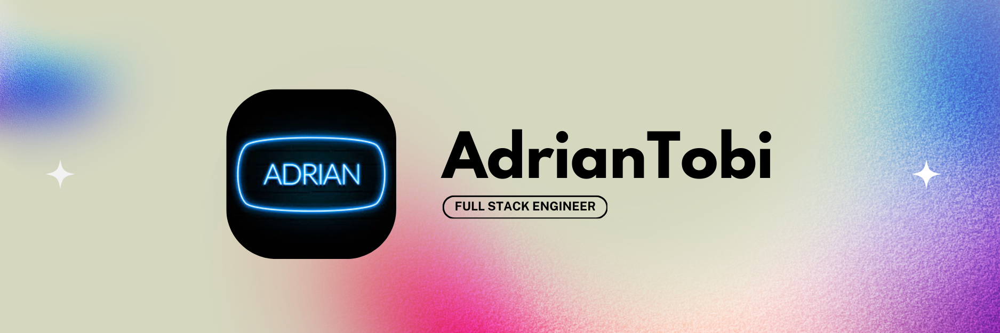

<picture width='100%' style="border-radius:25px;">
  <source media="(prefers-color-scheme: dark)" srcset="./adriantdBannerDark.png">
  <source media="(prefers-color-scheme: light)" srcset="./adriantdBannerLight.png">
  
</picture>

👋 Hi, I'm Adrian Tobi.
---
I’m a software engineer specializing in building and designing astonishing digital experiences for users. Currently, I’m focused on building some projects of my own.

✨ Skills
---
> What can I do?

### General
My Skills

- Web devlopment
  - React/JSX
  - Next.js Framework
  - Redux
- Web Scraping
  - Headless browser control with Puppeteer
  - Getting general information with Axios
- UI/Graphic Design
  - CSS/HTML

### Fluent Languages
My Skills

- Javascript/JSX
- Python
- Typescript
- Java

### JavaScript Specific Toolset
- NodeJS
- NPM
- HTML5 Canvas

👾 Software
---
> What's on my computer?

My Skills

- IDE: VSCode
- Design Software: Figma
- Browser: Chrome
- Notes: Obsidian

💻 Hardware
---
> What do I use?

- Computer: HP Envy
- Keyboard: Magic Refiner RK68
- Mouse: Logi MX 3S
